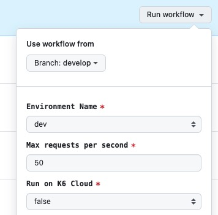

# Load Tests

This directory contains load tests for the application, using [k6](https://k6.io/).

## Prerequisites

1. [Install k6](https://grafana.com/docs/k6/latest/set-up/install-k6/)
1. [Install nvm](https://github.com/creationix/nvm)
1. VPN access - if you update this to hit private networks, make sure to connect to the appropriate VPN.

## Setup

1. Run `nvm use` to use the correct version of Node.js.
1. Run `npm install` to install the necessary dependencies.

## Running the tests

Run `K6_WEB_DASHBOARD=true k6 run <filename>.ts` to run the tests.
Click the URL that is output to view the results in the k6 web dashboard.

To close the tests once you're done, close the web browser tab or press `Ctrl+C` in the terminal.
You can stop the process at any time by pressing `Ctrl+C` in the terminal.

> [!TIP]
> You can automatically open the web dashboard by prepending K6_WEB_DASHBOARD_OPEN=true to the command.
> [Full web dashboard docs & options](https://grafana.com/docs/k6/latest/results-output/web-dashboard/).

Full example:
```sh
# Run the demo.ts test without the web dashboard.
k6 run tests/demo.ts

# Run the test with a max of 50 requests per second, open the web dashboard, and view the results in the web dashboard.
# Read on to learn about the script-level environment variables.
K6_WEB_DASHBOARD=true K6_WEB_DASHBOARD_OPEN=true k6 \
--env MAX_REQS_SECOND=50 \
run tests/demo.ts
```

### Note on VUs vs requests per second

Depending on how fast your application responds, you may find that you need to set a very high number of VUs (virtual users) to achieve the desired requests per second.

This is because each one will wait for the response before sending the next request, so if your application is slow, you will need more VUs to achieve the same number of requests per second.

In the cloud, VUs are limited based on your plan, so it's important to understand this relationship and set your expectations accordingly.


## Script-level environment variables

You can set [environment variables](https://grafana.com/docs/k6/latest/using-k6/environment-variables/) at the script level by using the `--env` (shorthand `-e`) flag.

For example, to set the `MAX_REQS_SECOND` environment variable, you would run `k6 run --env MAX_REQS_SECOND=50 tests/demo.ts`.

Each script can have its own environment variables.

Some useful additions could be:
- `ENVIRONMENT` - to specify the environment the test should hit (dev, staging, prod, etc.)
- `SCENARIO` - to allow different scenarios to be run with the same script, and selected through the workflow dispatch options. For example, you could have a `login` scenario and a `purchase` scenario that hit different endpoints and have different thresholds, but they could share the same setup code for authentication.

## Test files

The test files live in the `tests` directory. The following files are available:

- `demo.ts` - this hits the k6 test website and is a good starting point for understanding how k6 works.

## Running tests in Github Actions

An example `load-test.yaml` file in the `.github/workflows` directory can be used to run the tests in Github Actions.
It can be ran manually by going to the Actions tab in Github and clicking on the `Load Tests` workflow.

Screenshot of the "Run workflow" button and options in Github Actions UI:


You can also use the [GitHub CLI](https://cli.github.com/) to run the workflow manually. This is helpful if you are editing the workflow file and want to test it.
Github only lets you trigger a workflow manually from Github's UI if the workflow file is in the default branch.

```sh
gh workflow run load-test.yaml \
--field max_reqs_second=60 \
--ref your_branch
```

See [../.github/workflows/load-test.yaml](../.github/workflows/load-test.yaml) for the full workflow.

> [!TIP]
> If you want to send results to the cloud, add `--field cloud=true`. A test run will be created in the Grafana Cloud k6 dashboard & a link will be provided in the output.

The token for Grafana Cloud is stored in the `K6_CLOUD_TOKEN` secret in the Github repository. To get its value or regenerate it, go to Stack Tokens under Account Settings in the Grafana Cloud dashboard.

## Typescript/JavaScript notes

K6 runs the scripts in its runtime, and there are some constraints.

- You must use the full path to the module you are importing. Ex: `import ./constants` will not work, but `import './constants.ts'` will.

More about module resolution in k6 can be found [here](https://k6.io/docs/using-k6/modules#module-resolution).

# Further Reading

- [k6 examples](https://grafana.com/docs/k6/latest/examples/)
- [Different types of load testing](https://grafana.com/blog/2024/01/30/api-load-testing/)
- [Grot AI helper (LLM chatbot that's trained on k6 technical docs)](https://grafana.com/grot/)
- [k6 environment variables](https://grafana.com/docs/k6/latest/using-k6/environment-variables/)
