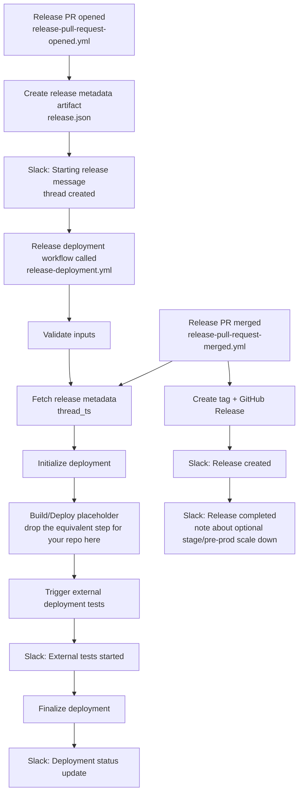

# Release automation workflow templates

This folder contains reusable release workflow examples adapted from a real-world setup and generalized for any repository.

## Release flow

## Notes

- Kubernetes build/deploy integration in `release-deployment.yml` is intentionally replaced with a placeholder step: `drop the equivalent step for your repo here`
- Workflows use `ubuntu-latest` by default. If your deployment requires private network access, switch relevant jobs to a custom self-hosted runner.

## Assumptions and disclaimers

- Release branch naming is expected to follow `release/x.y.z` (semantic version style), for example `release/1.2.3`.
- Release PR workflows are wired to PRs targeting `main`.
- The reusable deployment workflow validates `ENVIRONMENT` as `stage` or `production`; adjust this if your environment names differ.
- `COMMIT_HASH` overrides `BRANCH` when both are provided to the deployment workflow.
- The external tests integration (`your-org/qa-automation`) is an example and should be replaced with your actual repository/workflow.
- Slack notifications assume `RELEASES_SLACK_CHANNEL_ID` and `SLACK_BOT_TOKEN` are configured.
